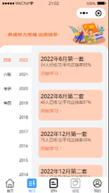
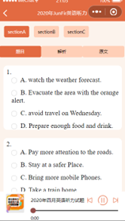
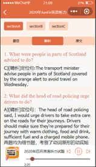
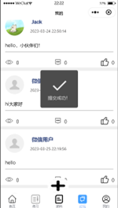
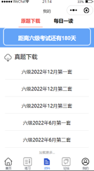

# DailyListening

​		这是一个英语四六级听力的微信小程序，具有实时反馈机制，还附有原文和答案解析。除此之外还有论坛、真题下载、每日一读等其他功能。该项目为团队独立完成，由于后端云服务器到期，部分需要api的功能未能使用，如论坛发表显示、往年题库下载等。请大家配置后台服务器即可使用，或者删去需要api的功能。

代码仅供参考学习。以下为部分功能演示

如果您有任何疑问，欢迎提交Issue~